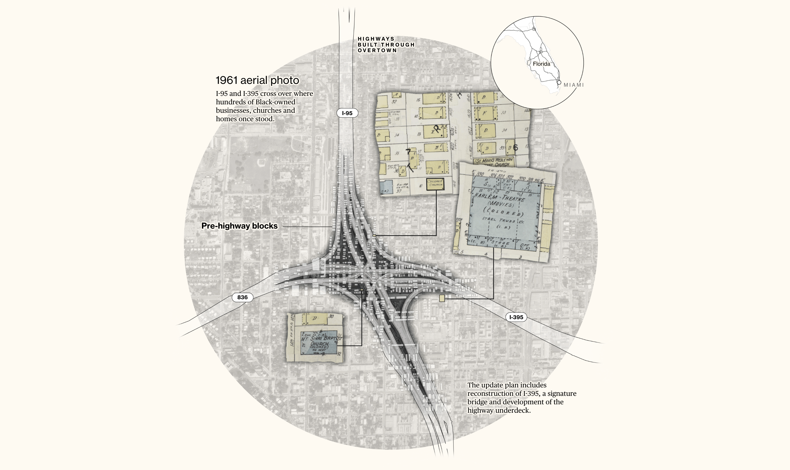

# Threads – Storytelling with Maps and Data

SPRING 2025  
Class: ARCH 6132: Intermediate Applications  
Location: The Gensler Family AAP NYC Center  
Meeting time: Thursdays 9:30am - 12pm  
Instructor: [Juan Francisco Saldarriaga](mailto:juanfrans@gmail.com) ([js3852@cornell.edu](mailto:js3852@cornell.edu))  
Office hours: Tuesdays 9am – 10:30am (By appointment – please [sign up](https://calendar.app.google/xCToLwfWspqMzgjEA) in advance)  
Grading: Letter  
Last modified: Dec 11, 2024

*The Department of Architecture acknowledges that Cornell University is located on the traditional homelands of the Gayogo̱hó:nǫʼ (Cayuga Nation). The Gayogo̱hó:nǫʼ are members of the Haudenosaunee Confederacy, an alliance of six sovereign Nations with a historic presence on this land. The Confederacy precedes the establishment of Cornell University, New York State, and the United States of America. We acknowledge the painful history of Gayogo̱hó:nǫʼ dispossession, and honor the ongoing connection of Gayogo̱hó:nǫʼ people, past, and present, to these lands and waters.*

*NYC LIVING LAND ACKNOWLEDGEMENT*

*The Gensler Family AAP NYC Center is located on the unceded homelands of the Lenape people. We offer this acknowledgment in recognition of the original people of this land, the Lenape, their resilience in the face of settler colonialism, and their deep connection to this place. The land that the Lenape occupied before the arrival of European settlers is known as Lenapehoking, Land of the People, an area including NYC and extending from Western Connecticut to Eastern Pennsylvania and from the Hudson Valley to New Jersey and Delaware. Lenape nations, communities, and individuals live in locations spanning the world, including five federally recognized nations in Oklahoma, Wisconsin, and Ontario. We acknowledge the painful history of Lenape dispossession and attempts of erasure, and honor the continuous connection of the Lenape people, past and present, to these lands and waters.*

## Summary

Threads – Storytelling with Maps and Data will teach students how to transform urban data into compelling visual narratives. Students will master rigorous spatial analysis, data visualization, and qualitative research to craft impactful stories about city life. By weaving together data, maps, and diverse voices, students will learn how to communicate complex urban issues in an engaging and accessible way.

## Rationale

Cities are awash in data, offering a wealth of information about urban life. While analyzing this data can reveal important insights, the results often feel abstract and disconnected from the lived experiences of city dwellers. To bridge this gap, *Threads – Storytelling with Maps and Data* will teach students how to transform raw data into compelling urban narratives.

This course will equip students with the skills to:

* **Conduct rigorous spatial analysis:** Students will learn to explore and analyze spatial urban datasets, extracting meaningful patterns and trends.  
* **Craft compelling visual narratives:** Students will master the art of data visualization, creating maps and graphics that communicate complex information in an engaging and accessible way.  
* **Incorporate diverse voices:** Students will learn to weave together quantitative data with qualitative insights, incorporating the perspectives of experts and everyday citizens to create richer and more nuanced stories.

By combining analytical rigor with storytelling techniques, students will learn to produce impactful narratives that resonate with audiences and shed light on the complexities of urban life.

*[What It Looks Like To Reconnect Black Communities Torn Apart By Highways](https://www.bloomberg.com/graphics/2021-urban-highways-infrastructure-racism/) – By Rachael Dottle, Laura Bliss And Pablo Robles*

## Course aims and objectives

Building upon the foundation established in ARCH 6131, this course delves deeper into the complexities of urban data and its role in shaping our understanding of cities. *Threads – Storytelling with Maps and Data* guides students to become skilled urban storytellers, capable of transforming raw data into compelling narratives that resonate with diverse audiences.

Specifically, this course aims to:

* Enhance Spatial Analysis Skills: Students will advance their abilities to acquire, process, analyze, and interpret spatial urban data, mastering techniques to uncover meaningful patterns and trends within complex datasets. This includes:  
  * Critically evaluating data sources and their limitations.  
  * Applying advanced geospatial analysis methods to explore urban phenomena.  
  * Developing analytical and critical thinking skills to interpret spatial patterns and draw informed conclusions.  
* Introduce Web Mapping as a Representation Technique: Students will gain proficiency in web mapping technologies and techniques, learning to create interactive and accessible maps that communicate spatial information effectively to a broad audience. This involves:  
  * Understanding the principles of cartographic design and user experience (UX) for web maps.  
  * Utilizing web mapping platforms and tools to design and publish interactive maps.  
  * Exploring innovative approaches to data visualization and storytelling through web-based mapping.  
* Cultivate Investigative Storytelling: Students will develop investigative and journalistic skills to gather diverse perspectives, conduct effective interviews, and synthesize qualitative information with quantitative data. This includes:  
  * Learning techniques for conducting interviews and collecting qualitative data.  
  * Exploring ethical considerations in data collection and representation.  
  * Developing narrative structures and storytelling techniques to craft compelling and engaging urban narratives.  
* Synthesize and Communicate Effectively: Students will learn to integrate spatial analysis, web mapping, and qualitative research to produce impactful multimedia narratives that illuminate the complexities of urban life. This involves:  
  * Weaving together data, maps, and diverse voices to create compelling and nuanced stories.  
  * Communicating research findings in a clear, accessible, and engaging manner for diverse audiences.  
  * Critically reflecting on the ethical implications of data-driven narratives and their potential impact on urban communities.

## Format and procedures

This course combines hands-on learning with inspiring guest lectures to guide students through the process of crafting compelling urban narratives.

**Team-Based Investigations:**

* Students will collaborate in pairs to investigate a New York City-based story focused on one of four themes: migration, justice, climate change, or energy.  
* This collaborative approach will encourage peer learning, diverse perspectives, and the development of teamwork skills essential in professional practice.

**Skill-Building through Assignments and Labs:**

* Instruction will primarily occur through a series of individual assignments and interactive lab sessions.  
* These hands-on activities will equip students with core skills in:  
  * **Data acquisition and processing:** Sourcing, cleaning, and preparing urban data for analysis.  
  * **Spatial analysis:** Employing geospatial techniques to uncover patterns and insights.  
  * **Data visualization:** Creating informative and engaging visual representations of data.  
  * **Web mapping:** Developing interactive maps to share spatial narratives online.  
  * **Narrative construction:** Integrating data, visuals, and text to craft compelling stories.  
* While assignments are primarily individual, students are encouraged to share their work and insights with their partners, fostering a collaborative learning environment.

**Inspiration from Guest Lectures:**

* Renowned practitioners and journalists with backgrounds in design and storytelling will deliver guest lectures throughout the semester.  
* These lectures will provide real-world insights into:  
  * The creative process behind impactful data-driven narratives.  
  * The challenges and rewards of communicating complex information to diverse audiences.  
  * The ethical considerations involved in data representation and storytelling.

**Culminating in a Web-Based Narrative:**

* Each student pair will produce a cohesive, map-based story that explores their chosen theme.  
* These final projects will be presented as interactive web features, leveraging the power of web mapping technologies to engage audiences.  
* Students will utilize Python and various visualization libraries to create compelling maps and data visualizations.  
* The final narratives will integrate text, images, audio, data visualizations, and spatial representations to create rich and immersive storytelling experiences.

## Instructor Assumptions

This course embraces a collaborative and experiential approach to learning, recognizing that knowledge creation is an iterative and often messy process. The class itself is designed as a collaborative journey involving students, guest lecturers, and the instructor. Therefore, students should expect a dynamic learning environment where challenges and unexpected questions are welcomed as opportunities for shared exploration and problem-solving. We believe that grappling with real-world complexities, rather than simply seeking straightforward answers, fosters deeper understanding and resilience. This collaborative approach mirrors the professional world, where teamwork and creative problem-solving are essential skills.

Similarly, this course provides a foundational understanding of geospatial analysis, web development, and journalistic practices, but it does not aim to provide comprehensive expertise in any single field. Instead, we focus on integrating key elements from each discipline to empower students to approach urban design challenges with a broader perspective, develop essential skills in data analysis, communication and storytelling, and explore new possibilities at the intersection of design, technology and social inquiry.

## Course Requirements

Attendance and Participation  
Attendance and participation are mandatory for lectures, lab sessions, pin-ups and reviews. In case of illness or other special circumstance, notification should be given to the instructor as soon as possible and must be given before the class.

Readings  
Readings and reference material will be assigned each week to be completed before each class. They will serve as the basis for class discussion.

Credits  
ARCH 6132 is 3 credits

Additional Requirements  
Additional material for lectures and labs will be available on [GitHub](https://github.com/juanfrans-courses/threads-storytelling-with-maps-and-data).

## Grading Procedures

Each class will begin with a discussion around the readings assigned the previous session. Students should participate in these discussions. Class participation will be wrapped into your attendance grade.

The core deliverable of this course is a group assignment due at the end of the semester, and the majority of assignments work towards producing graphics and narratives to be incorporated in the final. Despite this, all mapping and reporting assignments will be completed, submitted, and graded individually.

* 60% – Individual assignments  
* 30% – Final assignment
* 10% – Class attendance and participation

Late Work  
All assignments are due at the specified time and date. Any work that is not submitted on time may be submitted at any point during the remainder of the semester but prior to May 6, 2025\. Any late submission will receive a maximum grade of half credit. Late work submitted after the May 6 deadline will not be accepted.

## Academic Integrity

Each student in this course is expected to abide by the Cornell University Code of Academic Integrity ([http://cuinfo.cornell.edu/Academic/AIC.html](http://cuinfo.cornell.edu/Academic/AIC.html)). Any work submitted by a student in this course for academic credit will be the student's own work, except in the cases of projects that are specifically structured as group endeavors. Work by others shown in presentations and excerpted in papers must be properly cited and credited.

Students are encouraged to study together and to discuss information and concepts covered in lecture and the sections with other students. Students can give "consulting" help to or receive "consulting" help from such students.

Should copying occur, both the student who copied work from another student and the student who gave material to be copied will both automatically receive a zero for the assignment. Penalty for violation of this Code can also be extended to include failure of the course and University disciplinary action.

During examinations, you must do your own work. Talking or discussion is not permitted during the examinations, nor may you compare papers, copy from others, or collaborate in any way. Any collaborative behavior during the examinations will result in failure of the exam, and may lead to failure of the course and University disciplinary action.

Pursuant to Title 17 of the U.S. Copyright Act and Cornell University Policy 4.15, faculty own the copyright to all original course content – their copyright embodies course lectures as well as notes summarizing or capturing the lecture content. Students may take and use lecture notes solely for personal scholarship, and may share lecture notes only with others enrolled in the subject course. Students may not post, copy, republish, distribute or share lecture, course, or class content in any form or medium with anyone not enrolled in the subject course absent the express written permission of the faculty copyright holder. This prohibition applies to any platform or medium to which course lectures or notes are posted for the purpose of further distribution, whether for-profit or fee-free. Impermissible uses of copyrighted content constitute acts of copyright infringement and may further subject the student to violation(s) of the Code of Academic Integrity.

Student IP  
Students own the copyright to their work except under conditions specified in University Policy. The instructor and department may use students’ copyrighted works in their teaching, lectures, etc., internal to the course. If the Instructor wishes to further display or distribute the work beyond Cornell’s academic environment, the instructor will obtain express permission from the student and provide appropriate attribution. Permission forms will be available in the College communications office.

Images of students:  
For reasons including FERPA, DACA, and other privacy concerns, student permission is required before sharing photos or videos taken in studio, class, or on a field trip.

## Diversity and Inclusion: Our Commitment

We believe that design is a principal instrument of positive social change, and that progress and innovation are driven by a commitment to inclusion across race, class, ethnicity, gender, age, religion, ability and identity. For this reason, we explicitly confirm our resolute commitment to accelerate Cornell University’s actions to be a diverse and inclusive institution. We embrace the responsibilities of ongoing internal critical reflection, dialogue, and action as individuals and as a community. We support the Cornell teaching community—our faculty, staff, and students—in their efforts to act with an ethos of inclusivism and antiracism in creating and sustaining diverse teaching and learning environments.

Bias-related Incident Reporting System  
Cornell University is committed to fostering a safe, respectful, and inclusive living, learning, and working environment for our entire community. The bias-related incident reporting system is one step toward promoting that we, as an institution, live out these values. The reporting system allows for you to safely and anonymously report an incident you may have experienced or witnessed, receive support, and explore options for resolution.

To report an incident, individuals can use one of the following methods:

* By submitting an incident report online at [https://www.biasconcerns.cornell.edu/](https://www.biasconcerns.cornell.edu/) (non-emergency)  
* By contacting the Cornell University Police Department (CUPD) at (607) 255-1111 or 911 for emergency assistance

For students in New York City dial 911 for emergency assistance NOT CUPD.

## Accommodations for students with disabilities

In compliance with the Cornell University policy and equal access laws, the instructor is available to discuss appropriate academic accommodations that may be required for students with disabilities. Requests for academic accommodations are to be made during the first three weeks of the semester, except for in unusual circumstances, so arrangements can be made. Students are encouraged to register with Student Disability Services \[[https://sds.cornell.edu](https://sds.cornell.edu)\] to verify their eligibility for appropriate accommodations.

## Religious Holidays

Cornell University is committed to supporting students who wish to practice their religious beliefs. Students are advised to discuss religious absences with their instructors well in advance of the religious holiday so that arrangements for making up work can be resolved before the absence.

The New York State Legislature (since July 1, 1992\) requires all institutions (public and private) of higher education not to discriminate against students for their religious beliefs. Accordingly, the pertinent parts of Sections 3 and 4 of the law state:

“3. It shall be the responsibility of the faculty and of the administrative officials of each institution of higher education to make available to each student who is absent from school, because of his or her religious beliefs, an equivalent opportunity to…  make up any examination, study or work requirements which he or she may have missed because of such absence on any particular day  
or days…”

“4. If… classes, examinations, study or work requirements are held on Friday after four o’clock post meridian or on Saturday, similar or makeup classes, examinations, study or work requirements shall be made available on other days, where it is possible and practicable to do so.”

A list of religious holidays can be found here: [https://scl.cornell.edu/religiousholidays](https://scl.cornell.edu/religiousholidays).

## Tentative Class Schedule

| Week | Date | Class | Lab | Assignments | Readings |
| :---- | :---- | :---- | :---- | :---- | :---- |
| 1 | Jan 23, 2025 | Introduction & Work Environments | Work environments | Individual \- Personal site & GitHub repo |  |
| 2 | Jan 30, 2025 | Web mapping | Web mapping | Individual \- Create an interactive web map |  |
| 3 | Feb 6, 2025 | Lecture ([Rachael Dottle](https://www.bloomberg.com/authors/AU1nEMcaHjc/rachael-dottle)) & Interviewing | Interviewing | Individual \- Conduct 3 interviews |  |
| 4 | Feb 13, 2025 | GIS Core Concepts (CRS & Classification) | Projections & classifications | Individual \- 3 maps with different projections & classification (same data). Maps should be created on Colab & web. |  |
| 5 | Feb 20, 2025 | *(Virtual)* Public Data | Census data (attribute joins) | Individual \- Map with census data at two different scales. Related to the project. |  |
| 6 | Feb 27, 2025 | Lecture ([Grga Basic](https://grgabasic.com/)) & Desk Crit |  |  |  |
| 7 | Mar 6, 2025 |  Geoprocessing (Adv. GIS) | Points, buffers, overlay, joins |  |  |
| 8 | Mar 13, 2025 | Data Visualization (Marks & Encodings) |  | Individual \- 5 different charts with the same data Group \- Prepare the pitch |  |
| 9 | Mar 20, 2025 | Pitch | Presentations |  |  |
| 10 | Mar 27, 2025 | APIs | Querying API (Streetview, geocoding, etc) | Individual \- Map with data from an API |  |
| 11 | Apr 3, 2025 | Spring break (no class) |  |  |  |
| 12 | Apr 10, 2025 | Lecture ([Anjali Singhvi](https://www.nytimes.com/by/anjali-singhvi)) & Telling a story with maps | Scrollytelling |  | Martini glass structure |
| 13 | Apr 17, 2025 | *(Virtual)* Desk Crit |  |  |  |
| 14 | Apr 24, 2025 | Desk Crit |  |  |  |
| 15 | May 1, 2025 | Final review |  |  |  |

## Notepad – Ignore Anything Below

### Sample datasets

* NYC Energy building consumption  
* Citibike  
* Taxis and hailriding (TLC)  
* NYC Open Data  
* 311  
* PLUTO

### Useful links

* Good dataset and good topic for learning about biases and errors in the data:  
  * Foursquare release:  
    * [https://location.foursquare.com/resources/blog/products/foursquare-open-source-places-a-new-foundational-dataset-for-the-geospatial-community/](https://location.foursquare.com/resources/blog/products/foursquare-open-source-places-a-new-foundational-dataset-for-the-geospatial-community/)  
    * [https://opensource.foursquare.com/os-places/](https://opensource.foursquare.com/os-places/)  
    * [https://docs.foursquare.com/data-products/docs/categories](https://docs.foursquare.com/data-products/docs/categories)  
  * [https://www.linkedin.com/posts/ugcPost-7265867829252386817-iAMl/](https://www.linkedin.com/posts/ugcPost-7265867829252386817-iAMl/) (problems)  
  * [https://simonwillison.net/2024/Nov/20/foursquare-open-source-places/](https://simonwillison.net/2024/Nov/20/foursquare-open-source-places/) (how to download and use)  
* Examples:  
  * [https://projects.thecity.nyc/hazard-nyc-newtown-creek/](https://projects.thecity.nyc/hazard-nyc-newtown-creek/)  
  * [https://projects.thecity.nyc/hazard-nyc-gowanus-canal/](https://projects.thecity.nyc/hazard-nyc-gowanus-canal/)  
  * [https://blog.meliharvey.com/blog/02-urban-tree-cover/](https://blog.meliharvey.com/blog/02-urban-tree-cover/)  
  * [Off the charts newsletter \- The Economist](https://www.economist.com/newsletters/off-the-charts)  
* Cartography best practices:  
  * [Best practices for map design](https://proceedings.esri.com/library/userconf/fed16/papers/fed_86.pdf)  
